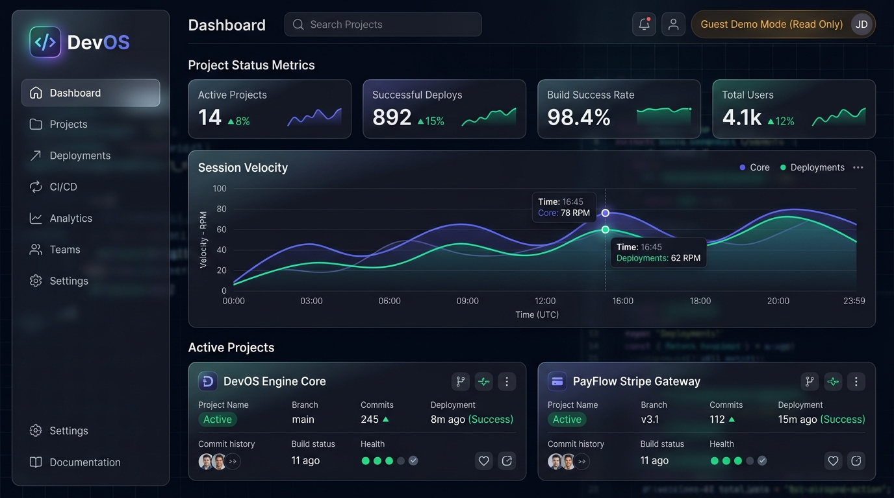
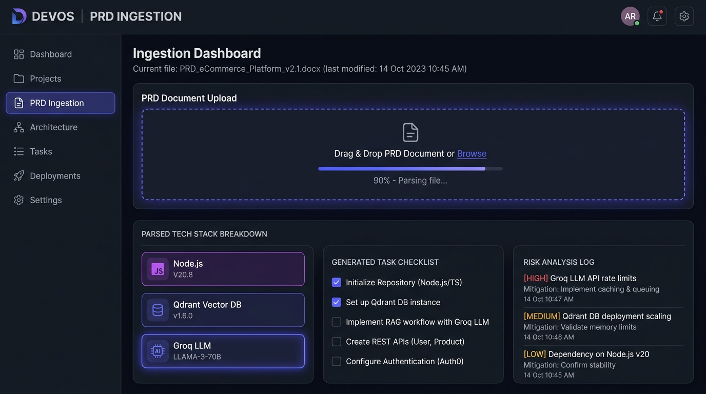
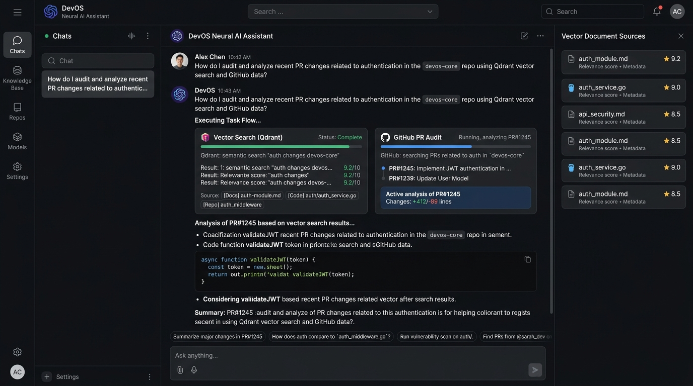

<div align="center">

# DevOS — Developer Context & AI Execution Engine

**DevOS** is a specialized operating environment for software engineers and engineering managers that integrates PRD parsing, developer session tracking, local codebase context, and multi-agent AI execution into a single platform.

[](https://reactjs.org)
[](https://typescriptlang.org)
[](https://vitejs.dev)
[](https://nodejs.org)
[](https://expressjs.com)
[](https://mongodb.com)
[](https://electronjs.org)

<br/>

### 🌐 [Try Guest Demo Mode (Live Web App)](https://dev-os-demo.vercel.app)

Try the full interactive interface in zero-config Guest Demo Mode (no login or backend setup required).

| Option | Download / Access Link | Platform | Details |
| :--- | :--- | :--- | :--- |
| **Live Web App** | [**Launch DevOS Web**](https://dev-os-demo.vercel.app) | Any Browser | Zero-config Guest Demo Mode with realistic mock SaaS projects & AI |
| **Windows Installer** | [**Download Setup 1.0.0.exe**](https://github.com/VanshArora01/Dev-OS/raw/main/downloads/DevOS%20Setup%201.0.0.exe) | Windows (x64) | Full desktop app with Start Menu shortcuts & background session logging |
| **Portable Binary** | [**Download DevOS 1.0.0.exe**](https://github.com/VanshArora01/Dev-OS/raw/main/downloads/DevOS%201.0.0.exe) | Windows (x64) | Standalone single-file executable |
| **Demo Video** | [**Watch DevOS Demo.mp4**](https://github.com/VanshArora01/Dev-OS/raw/main/DevOS%20Demo.mp4) | Video (MP4) | Walkthrough of live Google Drive, GitHub, and Gmail OAuth integrations |

</div>

---

## 📸 Product Screenshots

### 1. Developer Dashboard & Project Command Center


### 2. Automated PRD Ingestion & Task Extraction


### 3. Neural AI Assistant & Context RAG Engine


---

## 🧠 System Architecture & Workflow

DevOS operates on a decoupled client-server architecture with an optional Electron desktop wrapper:

```
                      ┌─────────────────────────────────────────────────────────┐
                      │              DevOS Frontend Web App / SPA               │
                      │  (React 18 + TypeScript + Vite + Guest Demo Engine)     │
                      └────────────────────────────┬────────────────────────────┘
                                                   │
                                     REST API / WebSockets / IPC
                                                   │
                      ┌────────────────────────────▼────────────────────────────┐
                      │                 DevOS Node.js / Express API             │
                      │         (Auth Middleware, Agent Routing, Tool Logic)   │
                      └────────┬───────────────────┬───────────────────┬────────┘
                               │                   │                   │
            ┌──────────────────▼───┐   ┌───────────▼───────────┐   ┌───▼──────────────────┐
            │    MongoDB Atlas     │   │   Qdrant Vector DB    │   │     AI Models        │
            │ (Projects, Sessions, │   │ (PRD Chunks & Codebase│   │  (Groq LLaMA 3.3 /   │
            │ Users, Integrations) │   │     Vector Embeddings)│   │   Gemini 1.5 Pro)    │
            └──────────────────────┘   └───────────────────────┘   └──────────────────────┘
```

### Core Execution Flow:
1. **PRD Ingestion Pipeline**: Document parsing converts uploaded text/PDF PRDs into structured tasks, tech stacks, and vector embeddings stored in Qdrant.
2. **Session Context Tracking**: Background process captures active development sessions, git activity, and elapsed task focus times.
3. **Neural AI Execution Engine**: Groq/Gemini-backed model routing uses dynamic tool selection to query codebase vectors, execute backend actions, generate technical summaries, and update project state.

---

## 🛠️ API Reference Overview

| Endpoint | Method | Description |
| :--- | :--- | :--- |
| `/api/projects` | `GET`, `POST` | List and create project workspaces |
| `/api/projects/:id` | `GET`, `PUT`, `DELETE` | Retrieve, update, or purge a specific project |
| `/api/projects/:id/prd` | `POST` | Upload and parse a PRD document into tasks and tech stack |
| `/api/ai/chat` | `POST` | Stream neural AI response with context injection |
| `/api/ai/agent` | `POST` | Multi-step agent execution with autonomous tool selection |
| `/api/integrations/google/auth` | `GET` | Initiate Google OAuth 2.0 flow |
| `/api/integrations/github/auth` | `GET` | Initiate GitHub OAuth 2.0 flow |
| `/api/sessions` | `GET`, `POST` | Log and retrieve developer productivity sessions |

---

## 📁 Repository Directory Structure

```
Dev-OS-1/
├── frontend/               # React SPA UI, TailwindCSS, Vite build system
│   ├── src/
│   │   ├── components/     # Reusable UI components & navigation controls
│   │   ├── context/        # State managers (Workspace, Onboarding)
│   │   ├── lib/            # API client, Guest Demo mode mock layer, auth
│   │   ├── pages/          # Dashboard, ProjectDetails, Assistant, Settings
│   │   └── test/           # Vitest unit & integration test suites
│   ├── vercel.json         # Vercel deployment configuration
│   ├── netlify.toml        # Netlify deployment configuration
│   └── package.json
├── backend/                # Express REST API & AI tool execution engine
│   ├── config/             # Database & AI model clients (MongoDB, Qdrant, Groq, Gemini)
│   ├── models/             # Mongoose database models
│   ├── routes/             # Express API route controllers
│   ├── services/           # Neural AI agent, RAG indexing, integration services
│   ├── tests/              # Jest API and unit test suites
│   └── package.json
├── electron/               # Electron desktop wrapper & build system
│   ├── main.js             # Electron main process & IPC handlers
│   └── package.json        # Packaging configuration (NSIS & Portable target)
├── docs/
│   └── screenshots/        # Product interface screenshots
├── CHANGELOG.md            # Release notes and version history
├── CONTRIBUTING.md         # Developer setup and contribution guide
└── TESTING.md              # Test execution instructions and coverage details
```

---

## 🚀 Deploying the Frontend (Vercel & Netlify)

The frontend is completely isolated and deployable as a static single-page web application (SPA) on Vercel, Netlify, or any static web host.

### Deployment on Vercel

1. **Import Repository**:
   - Push your repository to GitHub.
   - Go to [Vercel Dashboard](https://vercel.com) -> **Add New Project** -> Select `Dev-OS`.

2. **Configure Build Settings**:
   - **Framework Preset**: `Vite`
   - **Root Directory**: `frontend`
   - **Build Command**: `npm run build`
   - **Output Directory**: `dist`

3. **Set Environment Variables**:
   ```env
   VITE_CLERK_PUBLISHABLE_KEY=pk_test_your_clerk_key_here
   VITE_API_BASE_URL=https://your-backend-api.onrender.com/api
   ```
   *(Note: If no live backend URL is supplied, the app automatically runs seamlessly using built-in Guest Demo Mode).*

4. **Deploy**: Click **Deploy**. Vercel will process the rewrite rules in `frontend/vercel.json` for client-side routing.

---

### Deployment on Netlify

1. **Import Project**:
   - Go to [Netlify Dashboard](https://app.netlify.com) -> **Add new site** -> **Import an existing project**.

2. **Configure Build Settings**:
   - **Base directory**: `frontend`
   - **Build command**: `npm run build`
   - **Publish directory**: `frontend/dist`

3. **Deploy**: Netlify will apply SPA routing rules from `frontend/netlify.toml`.

---

## 💻 Local Development Setup

### Prerequisites
- **Node.js**: v18.0.0 or higher
- **MongoDB**: Local instance or MongoDB Atlas cluster connection URI
- **Groq & Gemini API Keys**: Optional (for live AI completions)

### Environment Configuration

#### 1. Backend (`backend/.env`)
```env
PORT=5000
MONGO_URI=mongodb+srv://<user>:<password>@cluster.mongodb.net/devos?retryWrites=true&w=majority

GROQ_API_KEY=your_groq_api_key_here
GROQ_VISION_MODEL=qwen/qwen3.8-27b
GEMINI_API_KEY=your_gemini_api_key_here

CLERK_SECRET_KEY=sk_test_your_clerk_secret_key_here
INTEGRATION_ENCRYPTION_KEY=your_encryption_key_here

GOOGLE_CLIENT_ID=your_google_client_id
GOOGLE_CLIENT_SECRET=your_google_client_secret
GOOGLE_REDIRECT_URI=http://localhost:5000/api/integrations/google/callback
```

#### 2. Frontend (`frontend/.env`)
```env
VITE_CLERK_PUBLISHABLE_KEY=pk_test_your_clerk_publishable_key_here
VITE_API_BASE_URL=http://localhost:5000/api
```

### Running Locally

```bash
# Start Backend REST Server
cd backend
npm install
npm run dev

# In a separate terminal, start Frontend Dev Server
cd frontend
npm install
npm run dev
```

---

## 🧪 Testing & Quality Assurance

DevOS includes complete automated test suites for both frontend and backend services:

- **Frontend (Vitest + React Testing Library)**:
  ```bash
  cd frontend
  npm test
  ```
- **Backend (Jest + Supertest)**:
  ```bash
  cd backend
  npm test
  ```

For detailed test coverage information and guidelines, see [TESTING.md](TESTING.md).

---

## ⚠️ Known Limitations

- **Google Drive & GitHub OAuth Verification**: Third-party OAuth apps require production app verification from Google/GitHub for external end-user login. Demonstration mode or local client credentials are recommended.
- **Qdrant Local Vector DB**: For local RAG vector search without a cloud Qdrant cluster, fallback in-memory matching is used.

---

## 📄 License

Distributed under the MIT License. See `LICENSE` for details.

